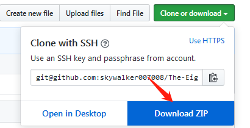

# **Welcome!**

**第八届北京市大学生围棋联赛**
**The Eighth Beijing University Student Go League**

# **How to use?**
## 1.git
> 使用git可以较为方便的快速更新。
> 
> git教程可以参考[git教程文档](git-readme.md)

## 2.在线下载
> 点击右上角原谅绿的clone or download图标

> 再点击Download ZIP保存即可

> 唯一麻烦的就是，每次更新需要重新下载，就很难受。

# **文档内容**

- [git-readme.md](git-readme.md) git获取最新文档方法
- [update.md](update.md) 信息更新日志
- [联赛赛程.xls](联赛赛程.xls) 联赛赛程总表格