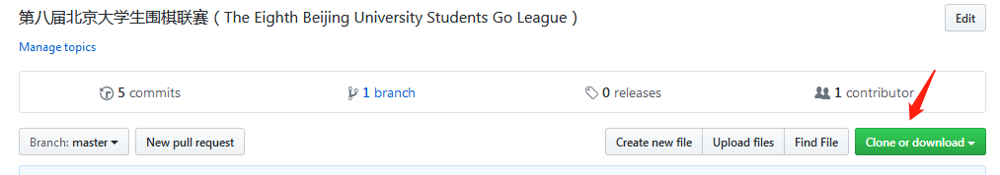
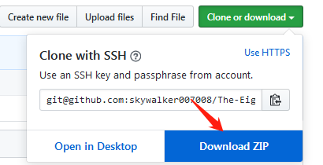

# **如何获取信息**

## 1.git
> 使用git可以较为方便的快速更新。
> 
> git教程可以参考[git教程文档](git-readme.md)

> 以下教程仅供各位更新数据用，想学习git的胖友们可以自行学习---
[git教程](http://www.runoob.com/git/git-basic-operations.html)

## **未完待续，敬请期待--**

## 2.在线下载
> 点击右上角原谅绿的clone or download图标

> 再点击Download ZIP保存即可

> 唯一麻烦的就是，每次更新需要重新下载，就很难受。

#### 更新数据请暂时使用download zip方法。

>> **
 &emsp;&emsp;&emsp;[返回主页](../../index.html) 
**